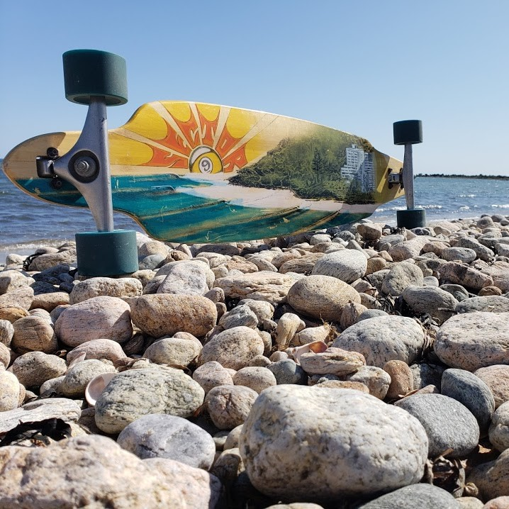

        
<b>Software Engineer</b> with a Bachelor of Science degree in Computer Science from the University of Massachusetts, Dartmouth; 2020 graduate.

        
Experience in C, Java, Python, SQL, HTML &amp; CSS, GitHub and Salesforce CRM.

        
Highly trainable and ready to roll as a team player or individual contributor.

        <a href="#contact">Contact info</a>  

    
    

        

            
<b>Software Engineer</b> with a Bachelor of Science degree in Computer Science from the University of Massachusetts, Dartmouth; 2020 graduate.

            
Experience in C, Java, Python, SQL, HTML &amp; CSS, GitHub and Salesforce CRM.

            
Highly trainable and ready to roll as a team player or individual contributor.

            
<a href="#contact">Contact info</a>
  
        

    

{{ "# **Experience**" | markdownify }}
**Global Power Systems (GPS) Intern**  
Doble Engineering  
Watertown & Marlborough, MA  
May - Aug, 2019  
Dec, 2019 - Jan, 2020  
* Entered and QA’d customer orders in  Microsoft Dynamics NAV  
* Initiated a process to streamline QA saving time and money  
* Distributed EMI (electro-magnetic interference) kits to engineers in the field  
* Organized and managed EMI inventory room and tracked items in Excel  
* Calibrated spectrum analyzers and other EMI equipment before shipment  

**Computer Laboratory Assistant**  
Center for Visual and Performing Arts (CVPA)  
UMass Dartmouth  
Dartmouth, MA  
Sept, 2019 - May, 2020  
* Updated software (Maya, graphics drivers, etc) and configured PCs
* Troubleshooted and resolved issues (Registry problems, connection to update servers, etc)

**Teaching Assistant**  
CodeWiz  
Westford, MA  
July - Aug, 2018  
* Taught elementary school students how to do basic programming
* Ensured my students had fun while completing their projects within allotted time

**Pressed Cafe, Einstein Bagels, Target, Best Buy, and Appleseed Crepe & Bread**  
2016-2019  
* Provided customer service and managed inventory
* Responsible for cash management, opening and closing, and security

{{ "# **Education**" | markdownify }}
UMass Dartmouth, Class of 2020  
Bachelor of Science (BS)  
Computer Science  
GPA: **3.2**  
  
* **Senior Design Project: NLP4NM (Natural Language Processing for Naval Messages)**  
  * Worked for Naval Undersea Warfare Center (NUWC) to make an automatic text parser for translating Naval Messages to parsable data  
  * **Scrum Master** for team; composed reports, organized team meetings, and created front-end implementation for text parser (Python, Flask, SQLite)    
* Led collaboration to create Android application for Android App Development class in short time period utilizing Java, SQL, JSON parsing, and XML editing [**Link on GitHub**](https://github.com/tehvedo/fehunitbuilder)  
* Junior Year Lab Assignments
  * Completed weekly coding assignments in C, including forking, message queues, and semaphores. Obtained 100/100 on every assignment    
* Completed biweekly rigorous assignments in C involving both iterative and procedural programming. Exempt from final exam due to exceptional class grades    
* **Dean's List Recipient (multiple years)**

{{ "# **Hobbies**" | markdownify }}

    

        
    

    

        
    

    

        
    

    

        
    

Longboarding, snowboarding, hiking & nature photography, and hanging with my friends and family.  

{{ "# **Resume**" | markdownify }}
Download my full resume [**here**](https://docs.google.com/document/d/1s4SIUuEENXUxwgMfRFg00Tr1pSFCsMaY7A9F86chPZI/export?format=pdf)

{{ "# **Contact Info**" | markdownify }}
Send me an email at: [**evanscruzen@gmail.com**](mailto:evanscruzen@gmail.com)  
Or check out my [**LinkedIn**](https://www.linkedin.com/in/evan-cruzen-486b63128)

