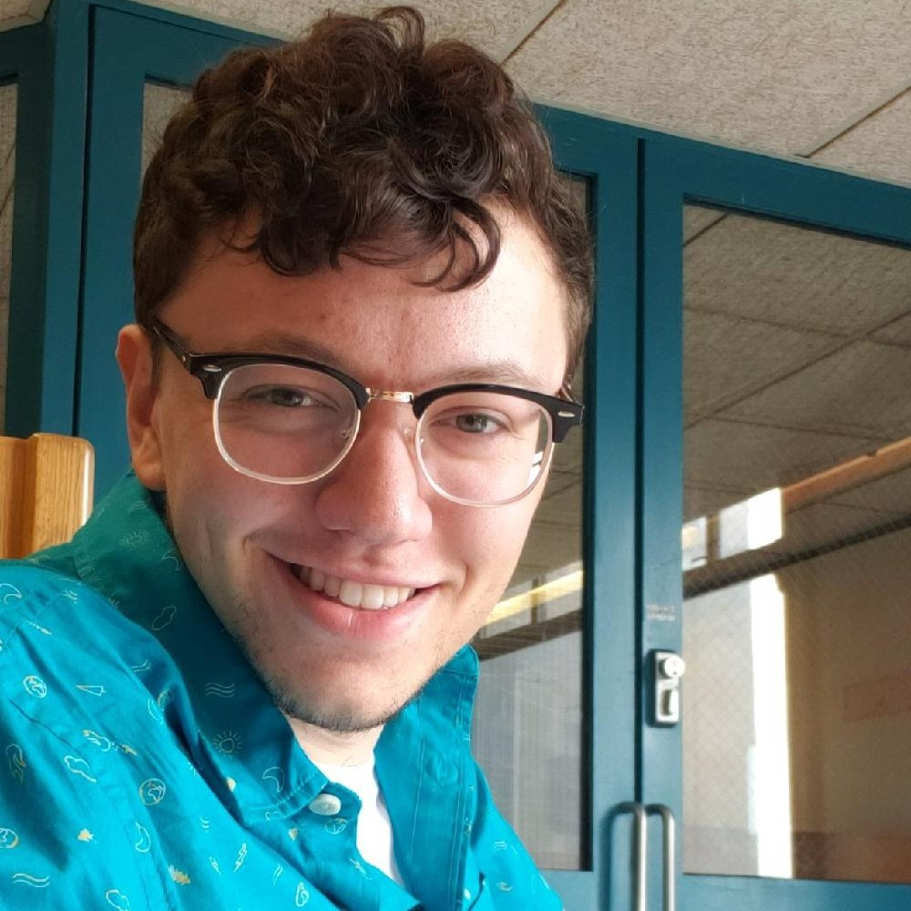

<link rel="apple-touch-icon" sizes="180x180" href="/favicon/apple-touch-icon.png">
<link rel="icon" type="image/png" sizes="32x32" href="/favicon/favicon-32x32.png">
<link rel="icon" type="image/png" sizes="16x16" href="/favicon/favicon-16x16.png">
<link rel="manifest" href="/site.webmanifest">
<link rel="mask-icon" href="/favicon/safari-pinned-tab.svg" color="#009cc9">
<meta name="msapplication-TileColor" content="#da532c">
<meta name="theme-color" content="#ffffff">

    <h1><b>Welcome to my site.</b></h1>
    
I am a Software Engineer with a Bachelor of Science degree in Computer Science from the University of Massachusetts, Dartmouth.

    
I have experience in C, Java, Python, HTML &amp; CSS.

    
Highly trainable. Ready to roll.

    
<a href="#contact">Contact info</a>

    
    

        

            <h1><b>Welcome to my site.</b></h1>
            
I am a Software Engineer with a Bachelor of Science degree in Computer Science from the University of Massachusetts, Dartmouth.

            
I have experience in C, Java, Python, HTML &amp; CSS.

            
Highly trainable. Ready to roll.

            <a href="#contact">Contact info</a>  
        

    

{{ "# **Education**" | markdownify }}
UMass Dartmouth, Class of 2020  
Bachelor of Science (BS)  
Computer Science  
  
* **Senior Design Project: NLP4NM**  
  * Worked for Naval Undersea Warfare Center (NUWC) to make an automatic text parser for translating Naval Messages to parsable data <!--[**Link on GitHub**](https://github.com/Wamadahama/NLP4NM/)  -->
  * **Scrum Master** for team; composed reports, organized team meetings, and created front-end implementation for text parser (Python, Flask, SQLite)    
* Led collaboration to create Android application for Android App Development class in short time period utilizing Java, SQL, JSON parsing, and XML editing [**Link on GitHub**](https://github.com/tehvedo/fehunitbuilder)  
* Junior Year Lab Assignments
  * Completed weekly coding assignments in C, including forking, message queues, and semaphores. Obtained 100/100 on every assignment    
* Completed biweekly rigorous assignments in C involving both iterative and procedural programming. Exempt from final exam due to exceptional class grades    
* **Dean's List Recipient (multiple years)**

{{ "# **Experience**" | markdownify }}
**Global Power Systems (GPS) Intern**  
Doble Engineering  
Marlborough, MA  
May, 2019 - Aug, 2019  
Dec, 2019 - Jan, 2020  
* Distributed electro-magnetic interference (EMI) kits to engineers in the field  
* Entered and QA'd customer orders utilizing Microsoft Dynamics NAV  
* Performed EMI equipment calibration

**Computer Laboratory Assistant**  
Center for Visual and Performing Arts (CVPA)  
UMass Dartmouth  
Dartmouth, MA  
Sept, 2019 - May, 2020  
* Performed IT duties such as updating and configuring multiple PC labs  
* Troubleshooted issues (Registry problems, connection to update servers, etc)  

**Temporary Teaching Assistant**  
CodeWiz  
Westford, MA  
July, 2018 - Aug, 2018  
* Taught elementary school students coding to develop their own Android applications  
* Ensured my students had fun while completing their projects within allotted time  

{{ "# **Resume**" | markdownify }}
Download my resume [**here.**](/assets/Evan_Cruzen_Resume.pdf)

{{ "# **Contact Info**" | markdownify }}
Send me an email at: [**evanscruzen@gmail.com**](mailto:evanscruzen@gmail.com)  
Or check out my [**LinkedIn**](https://www.linkedin.com/in/evan-cruzen-486b63128)

